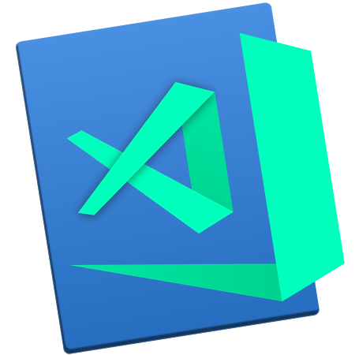
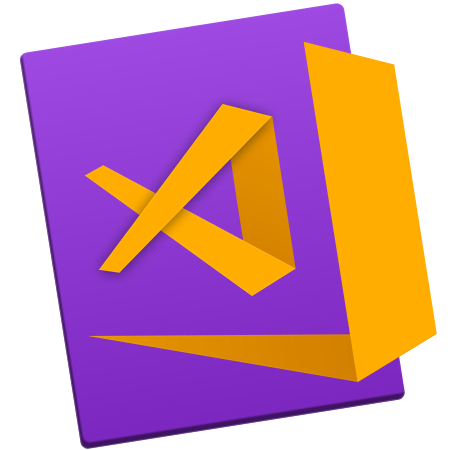

# VS Iconifyer 🛠

#### A handy tool that lets you mix up the old VS Code icon and exports a .icns or .png 

</img>

## 📆 Coming Soon 👨‍💻
- different templates (round, neon, images)
- detailed explainer of changing the app icon

